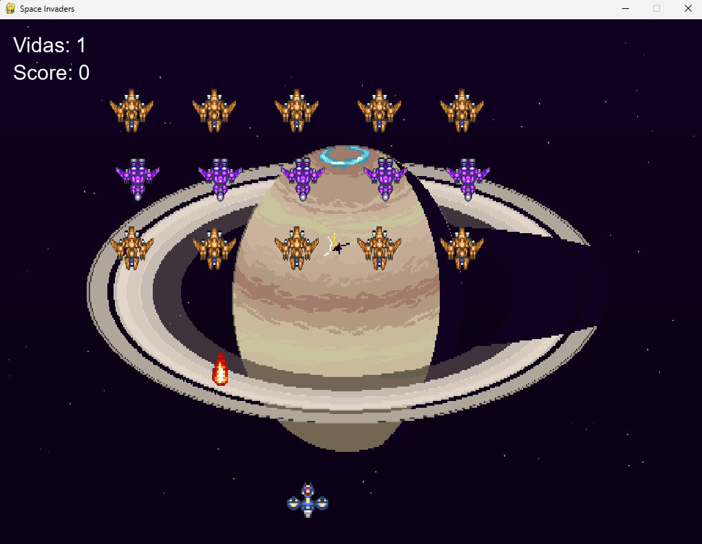

# 🚀 Space Invaders

Projeto desenvolvido para a disciplina de Programação utilizando **Python** e a biblioteca **Pygame**.

O objetivo foi criar uma versão demo jogável de um jogo, contendo menu principal, sistema de pontuação, condição de vitória e derrota, além de efeitos sonoros e músicas.

---

## 🎮 Gameplay

O jogador controla uma nave espacial e deve eliminar todas as naves inimigas antes de perder suas vidas.

### Controles

- ⬅️ Seta Esquerda: mover para a esquerda
- ➡️ Seta Direita: mover para a direita
- Tecla Espaço: atirar

---

## 📸 Imagem do jogo



---

## ✨ Funcionalidades

- Menu inicial
- Sistema de vidas
- Sistema de pontuação
- Inimigos com múltiplos pontos de vida
- Tiros do jogador
- Tiros dos inimigos
- Tela de vitória
- Tela de derrota
- Música de fundo
- Efeitos sonoros

---

## 🛠️ Tecnologias Utilizadas

- Python 3
- Pygame

---

## 📂 Estrutura do Projeto

```text
space_invaders/
│
├── assets/
├── codigo/
├── main.py
├── requirements.txt
└── README.md
```

---

## ▶️ Como Executar

Clone o repositório:

```bash
git clone https://github.com/Filipe-glitch/space-invaders.git
```

Acesse a pasta do projeto:

```bash
cd space-invaders
```

Instale as dependências:

```bash
pip install -r requirements.txt
```

Execute o jogo:

```bash
python main.py
```

---

## 🎨 Créditos dos Assets

Os assets utilizados neste projeto foram obtidos a partir de recursos gratuitos disponibilizados pela comunidade de desenvolvimento de jogos:

- CraftPix
- OpenGameArt
- Freesound

Todos os direitos dos respectivos assets pertencem aos seus criadores originais.

---

## 🎓 Projeto Acadêmico

Trabalho desenvolvido como atividade prática da disciplina de Programação, utilizando conceitos de:

- Programação Orientada a Objetos (POO)
- Modularização
- Eventos
- Manipulação de Sprites
- Colisões
- Desenvolvimento de Jogos 2D com Pygame

---

## 👨‍💻 Autor

**Filipe Mariano Rocha**